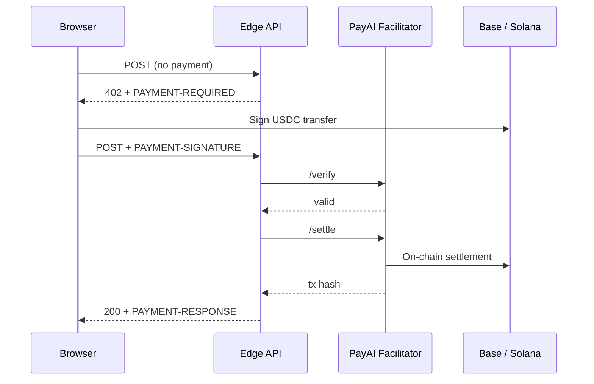

# Architecture

## Stack

| Layer | Technology |
|-------|------------|
| UI | Static HTML/CSS/JS — `public/executive-lounge.html`, `public/about.html` |
| Client payments | Bundled `public/js/x402-pay.mjs` (from `lib/x402-browser-client.ts`) |
| Dev server | Vite + `lib/concierge-dev-plugin.ts` (proxies `/api/*` in local dev) |
| API routes | Vercel **Edge** functions under `api/` |
| AI | Google Gemini (`api/lib/concierge-gemini.ts`) |
| Payments | x402 v2 via PayAI HTTP facilitator (`api/lib/x402-server.ts`) |
| Signals + memory | Upstash Redis / Vercel KV (`api/lib/signal-store.ts`, `api/lib/lounge-memory.ts`) |
| TanStack Start | Present under `src/` for scaffold/build; production lounge is primarily static + Edge APIs |

## Repository layout

```
api/                          # Vercel Edge handlers
  concierge.ts                # Concierge AI
  market.ts                   # Free feed
  news-open.ts                # Paid article unlock
  signal-publish.ts           # Paid publish
  signal-open.ts              # Paid signal unlock
  x402-config.ts              # Public x402 config
  well-known-x402.ts          # /.well-known/x402
  openapi.ts                  # /openapi.json
  lib/
    x402-server.ts            # Payment gate + 402 responses
    x402-discovery.ts         # x402scan discovery documents
    concierge-brain.ts        # System prompts + language detection
    concierge-gemini.ts       # Gemini calls
    signal-store.ts             # KV persistence
    lounge-memory.ts            # Concierge context ingest
    lounge-market.ts            # Feed merge (RSS + signals)
public/
  executive-lounge.html       # Main SPA
  js/x402-pay.mjs             # Built payment client
lib/
  x402-browser-client.ts      # Wallet + x402 fetch wrapper
  concierge-dev-plugin.ts     # Local API emulation
vercel.json                   # Rewrites, headers, build output
```

## Request flow (paid API)



## Payment gate order

All paid routes use `guardPaidX402Api()` in `api/lib/x402-server.ts`:

1. `OPTIONS` → `204`
2. `GET` / `HEAD` without payment → **402** (for [x402scan](x402scan.md) probes)
3. `POST` without payment → **402**
4. `POST` with valid payment → origin check → handler logic

This ensures registrars and agents see a valid x402 challenge instead of `405 Method Not Allowed`.

## Discovery flow (x402scan)

1. Scanner fetches `https://your-domain/openapi.json` or `/.well-known/x402`
2. Obtains four resource URLs
3. Probes each with `GET` and `POST` → expects **402** with `PAYMENT-REQUIRED` and non-empty `accepts`
4. After real payments, facilitator settlements appear in the x402scan transaction index

## Data stores

| Store | Content |
|-------|---------|
| Redis/KV — signals | Published creator signals |
| Redis/KV — ledger | Reader unlock revenue attribution (off-chain settlement) |
| Redis/KV — memory | Headlines + signal snippets for Concierge prompts |

Exact key namespaces are defined in server code only—not duplicated in public docs.

Requires `KV_REST_API_URL` + `KV_REST_API_TOKEN` (or Upstash equivalents) in production.
