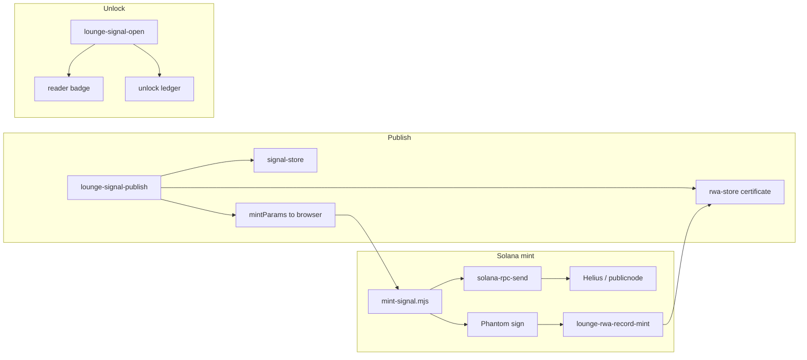
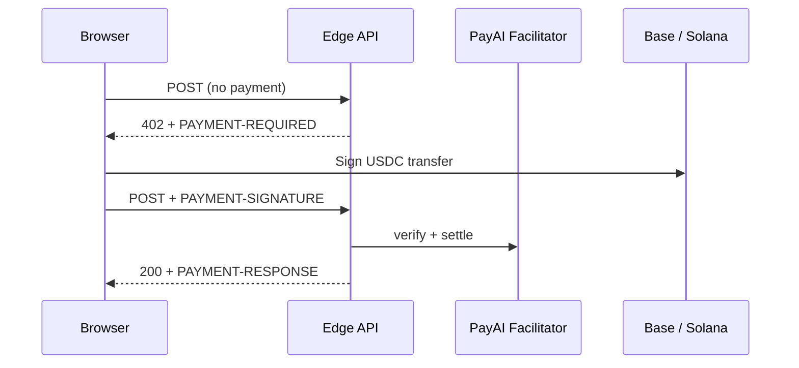

# Architecture

## Stack

| Layer | Technology |
|-------|------------|
| UI | Static HTML/CSS/JS — `public/executive-lounge.html`, `public/about.html` |
| Client payments | `public/js/x402-pay.mjs` ← `lib/x402-browser-client.ts` |
| Client Solana NFT mint | `public/js/mint-signal.mjs` ← `lib/mint-signal-browser.ts` |
| Dev server | Vite + `lib/concierge-dev-plugin.ts` |
| API routes | Vercel **Edge** (`runtime: "edge"`) under `api/`; some **Node** routes for payouts / legacy mint |
| AI | Google Gemini (default) + optional GLM-4.7 Flash, HYRE Gateway, Anthropic Claude, and OpenAI GPT-5.6 (`backend/concierge-api/concierge-gemini.ts`, `concierge-glm.ts`, `concierge-hyre.ts`, `concierge-anthropic.ts`, `concierge-openai.ts`) |
| Payments | x402 v2 via PayAI + Dexter fallback (`lib/concierge-api/x402-server.ts`) |
| Signals + RWA + memory | Vercel KV / Upstash (`signal-store`, `rwa-store`, `lounge-memory`) |
| TanStack Start | `src/` scaffold; production lounge is static HTML + Edge APIs |

## Repository layout

```
api/
  concierge.ts                 # Concierge AI (Edge)
  market.ts                    # Free feed
  news-open.ts                 # Paid article unlock
  lounge-signal-publish.ts     # Paid publish + RWA cert + mintParams
  lounge-signal-open.ts        # Paid unlock + reader badge
  lounge-rwa-record-mint.ts    # Persist Phantom mint result
  solana-rpc-send.ts           # HTTP Solana JSON-RPC proxy (browser mint)
  rwa-token.ts, rwa-badges.ts, rwa-metadata.ts
  lounge-rwa-mint-sol.ts       # Optional server mint (Node)
  lounge-rwa-mint-sol.ts     # Solana NFT mint proxy (Node)
  x402-config.ts, well-known-x402.ts, openapi.ts
  zauth-directory.ts, zauth-status.ts
  lib/
    signal-publish-handler.ts, signal-open-handler.ts
    rwa-token.ts, rwa-store.ts, rwa-solana-mint.ts
    x402-server.ts, x402-solana-rpc.ts
    zauth.ts, zauth-paid-response.ts
    lounge-market.ts, lounge-memory.ts
lib/
  mint-signal-browser.ts       # Metaplex createNft + Phantom
  on-chain-meta.ts             # 32-byte name truncation
  x402-browser-client.ts
public/
  executive-lounge.html
  js/x402-pay.mjs, js/mint-signal.mjs
  deploy-version.txt           # Written at build time
vercel.json
```

## RWA data flow



## Request flow (paid API)



Publish may return **200** with `mintParams` before a separate Phantom SOL mint (not part of x402).

When `ZAUTH_API_KEY` is set, successful paid handlers also enqueue async telemetry to [zauth](https://zauth.inc/) Provider Hub (`api/lib/zauth-paid-response.ts`). See [zauth.md](zauth.md).

## Payment gate order

`guardPaidX402Api()` in `api/lib/x402-server.ts`:

1. `OPTIONS` → `204`
2. `GET` / `HEAD` without payment → **402** (x402scan probes)
3. `POST` without payment → **402**
4. `POST` with valid payment → origin check → handler

Resource kinds map to URLs in `api/lib/x402-server.ts` (`signal-publish` → `/api/lounge-signal-publish`, etc.).

## Data stores

| Store | Content |
|-------|---------|
| KV — signals | Published creator signals |
| KV — RWA | Certificates, badges, wallet indexes |
| KV — ledger | Unlock revenue attribution |
| KV — memory | Headlines + signals for Concierge |

Requires `KV_REST_*` in production.

## Build pipeline

`npm run build`:

1. Vite → `dist/client`
2. `scripts/write-deploy-version.mjs` → `public/deploy-version.txt`
3. `scripts/build-x402-client.mjs` → `public/js/x402-pay.mjs`
4. `scripts/build-mint-signal.mjs` → `public/js/mint-signal.mjs`
