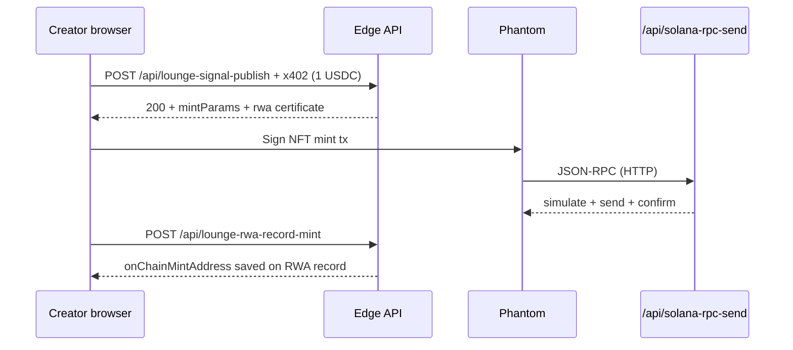

# RWA — Real World Assets (intelligence signals)

Executive Lounge is an **RWA-enabled** product: every **creator signal** is registered as a tokenized **intelligence certificate**. On **Solana**, creators can receive a **Metaplex NFT** in their own wallet after publishing. Readers earn **off-chain reader badges** when they unlock signals.

This document is the hub for RWA behavior. Solana mint operations are detailed in [rwa-solana-setup.md](rwa-solana-setup.md).

## What “RWA” means here

| Term | Meaning in this project |
|------|-------------------------|
| **RWA certificate** | Off-chain record: `tokenId`, `contentHash`, metadata (name, image, attributes), linked to `sig_*` |
| **On-chain NFT** | Solana Metaplex NFT whose **owner** is the creator wallet; metadata URI points at `/api/rwa-metadata?signalId=…` |
| **Reader badge** | Off-chain loyalty tier per wallet based on unlock count (not an NFT today) |

We do **not** custody user assets. Publish/unlock fees settle via **x402 USDC** to the merchant; NFT mint gas is paid by the **creator in SOL** in Phantom.

## End-to-end publish flow (Solana creator)

1. **Pay 1 USDC** — anti-spam; signal + off-chain RWA saved in KV.
2. **Mint NFT in Phantom** — browser bundle `public/js/mint-signal.mjs` (from `lib/mint-signal-browser.ts`) uses Metaplex `createNft` + `sendAndConfirm` against **`/api/solana-rpc-send`** (server RPC proxy; no API keys in the browser).
3. **Record mint** — `POST /api/lounge-rwa-record-mint` stores `mintAddress` + `tx` on the signal’s RWA record.

**EVM creators:** receive the off-chain RWA certificate only until Base ERC-1155 mint is implemented (`RWA_SIGNAL_CONTRACT_EVM`).

## Off-chain certificate (all chains)

On successful publish (`api/lib/signal-publish-handler.ts`):

1. Signal stored in Redis/KV (`sig_*`).
2. `mintSignalRwaToken()` registers certificate with:
   - `tokenId` — e.g. `rwa_…`
   - `contentHash` — SHA-256 of canonical title/summary/categories/creator/publishedAt
   - Metadata JSON (long-form name for IPFS-style display; see [rwa-metadata](api-reference.md#get-apirwa-metadata))
3. `rwaTokenId` attached to the signal; feed shows **⬡ RWA**.

Storage keys (Redis):

- `lounge:rwa:token:{signalId}`
- `lounge:rwa:badge:{badgeId}`
- `lounge:rwa:wallet-badges:{wallet}`
- `lounge:rwa:wallet-unlocks:{wallet}`

## On-chain NFT (Solana)

| Role | Wallet |
|------|--------|
| **NFT owner (recipient)** | Creator’s connected Solana address |
| **Mint signer** | Creator’s Phantom (pays SOL rent + fees) |
| **Optional collection** | `RWA_SIGNAL_CONTRACT_SOL` — must be valid; invalid collection is retried without collection |
| **Legacy server minter** | `RWA_MINT_SOL_SECRET` (“ConcEx NFT” authority) — optional; `POST /api/lounge-rwa-mint-sol` (Node) may be unavailable on some Vercel plans |

### On-chain metadata name limit

Metaplex allows **32 bytes** for the on-chain `name` field (not 32 Unicode characters). The server sends `truncateOnChainMetaName(signal.title)` in `mintParams`; the client applies the same helper (`lib/on-chain-meta.ts`). Long titles or emoji can trigger program error **`0xb` (NameTooLong)** if not truncated.

### RPC requirements

- Browser mint uses **only** `https://your-domain/api/solana-rpc-send`.
- Set **`SOLANA_RPC_URL`** on Vercel to **Helius** or rely on **publicnode** fallback.
- **Do not** use `solana.drpc.org` or Ankr free tier — they block `getLatestBlockhash`.
- Console **WebSocket errors** to `wss://…/api/solana-rpc-send` may appear during confirm; mint can still succeed (HTTP path). Do not deploy experimental “HTTP-only confirm” builds unless tested — production uses `sendAndConfirm` as in commit `24f8f9f`.

### Creator requirements

- **~0.03 SOL** in Phantom for mint rent/fees (in addition to **1 USDC** publish fee).
- Approve the **NFT mint** prompt soon after publish; delayed approval can cause blockhash expiry.

## Reader badges (unlock)

On successful `POST /api/lounge-signal-open`:

1. One badge per **wallet + signal** (re-unlock does not duplicate).
2. Tier from total unlock count:

| Unlocks | Tier |
|---------|------|
| 1+ | Intel Scout |
| 5+ | Intel Analyst |
| 15+ | Intel Strategist |
| 40+ | Principal Reader |
| 100+ | Sovereign Intel |

## Public API

| Endpoint | Method | Purpose |
|----------|--------|---------|
| `/api/rwa-token?signalId=` | GET | RWA certificate for a signal |
| `/api/rwa-badges?wallet=` | GET | Reader badges for a wallet |
| `/api/rwa-metadata?signalId=` | GET | JSON metadata (NFT `uri` target) |
| `/api/lounge-rwa-record-mint` | POST | Persist client mint after Phantom |
| `/api/solana-rpc-send` | POST | Solana JSON-RPC proxy for browser mint |
| `/api/lounge-rwa-mint-sol` | POST | Optional server-side mint (internal key) |

## UI

- Feed cards: **⬡ RWA** on tokenized creator signals.
- **Mint & Publish** — x402 publish then Phantom NFT step for Solana.
- Wallet view: reader badges; collectibles show NFT when mint succeeded.
- Signal reader modal: RWA id + badge after unlock.

## Code map

| Area | Path |
|------|------|
| RWA token + metadata | `api/lib/rwa-token.ts`, `api/lib/rwa-metadata-json.ts` |
| Store | `api/lib/rwa-store.ts` |
| Publish + `mintParams` | `api/lib/signal-publish-handler.ts` |
| Client mint | `lib/mint-signal-browser.ts` → `public/js/mint-signal.mjs` |
| Name truncation | `lib/on-chain-meta.ts` |
| Server mint (optional) | `api/lib/rwa-solana-mint.ts`, `api/lounge-rwa-mint-sol.ts` |
| Record client mint | `api/lounge-rwa-record-mint.ts` |
| RPC proxy | `api/solana-rpc-send.ts`, `api/lib/x402-solana-rpc.ts` |

## Related docs

- [creator-signals.md](creator-signals.md) — publish/unlock, validation, revenue
- [rwa-solana-setup.md](rwa-solana-setup.md) — env vars, RPC, troubleshooting
- [configuration.md](configuration.md) — all environment variables
- [api-reference.md](api-reference.md) — HTTP contracts
