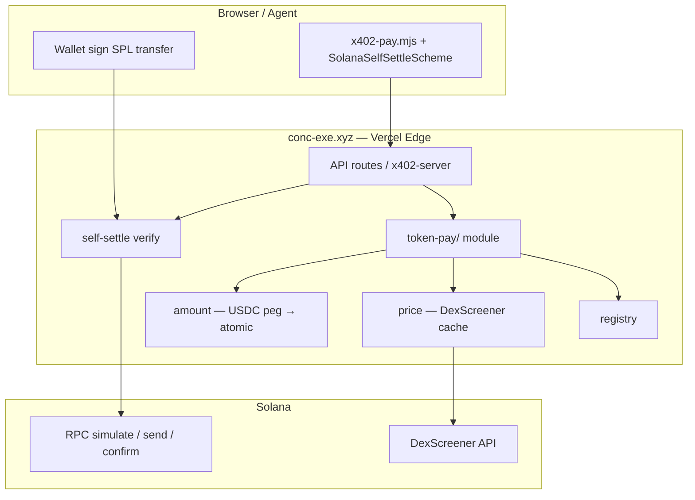

# Token Pay Platform

**Concierge Token Pay** lets each project monetize its **native SPL token** via **x402 self-settle** — without building RPC, price oracle, or on-chain verification infra.

**Public documentation (for integrators):** https://conc-exe.xyz/docs/payment/token-pay

Today the **default merchant is SOON** (Concierge utility token). UI may still say “SOON”; swap branding via env (`TOKEN_PAY_SOON_SYMBOL`) or add merchants in `TOKEN_PAY_MERCHANTS_JSON`.

---

## Positioning

| | PayAI / Dexter | Concierge Token Pay |
|---|----------------|---------------------|
| Model | Facilitator (gasless USDC) | **Self-settle** (user pays SOL gas) |
| Asset | USDC-first | **Project native token** |
| Infra | Hot wallet, fee sponsor | RPC verify + DexScreener price |
| Vercel Hobby | N/A (external) | **Fits** (no facilitator wallet) |

Pitch:

> Every project can monetize its native token via x402 without building its own infra — self-settle, DexScreener price, plug into a Concierge-style stack.

---

## Architecture



### Module layout (`backend/concierge-api/token-pay/`)

| File | Role |
|------|------|
| `types.ts` | `TokenPayMerchant`, platform types |
| `mint.ts` | Solana mint validation |
| `merchants/soon.ts` | Default merchant from `SOON_*` env |
| `registry.ts` | Merchant list + `TOKEN_PAY_MERCHANTS_JSON` |
| `price.ts` | DexScreener + per-merchant cache |
| `amount.ts` | USDC list price → token atomic |
| `self-settle.ts` | simulate → broadcast → confirm → delta |
| `x402.ts` | x402 accepts integration |
| `index.ts` | Public exports |

Legacy shims (do not add logic here):

- `soon-price.ts`, `soon-x402.ts`, `x402-soon-settle.ts` → re-export `token-pay`

### HTTP APIs

| Endpoint | Description |
|----------|-------------|
| `GET /api/token-pay` | Platform meta + all merchants |
| `GET /api/token-pay?merchant=soon` | Single merchant public config |
| `GET /api/x402-config` | Includes `tokenPay` + legacy `soonX402` |
| `GET /api/token-pay-analytics` | Per-merchant stats |
| `GET/POST /api/token-pay-build-accept` | Server-built accept for partner APIs (`resourceKind: external`) |
| `POST /api/token-pay-verify` | Verify + settle partner payments (PAYMENT-SIGNATURE) |

All routes go through **existing** Edge router `api/[...path]` — no new Vercel serverless function.

---

## Merchant model

```typescript
type TokenPayMerchant = {
  id: string;              // "soon", "acme"
  symbol: string;          // UI: "SOON"
  name: string;
  mint: string | null;     // null = coming soon
  decimals: number;
  payTo: string | null;    // X402_SOL_PAY_TO
  x402Enabled: boolean;
  price: {
    source: "dexscreener" | "env";
    fallbackUsd: number | null;
    maxAgeSec: number;
  };
  resourceKinds: string[]; // e.g. ["concierge"]
  comingSoonMessage: string;
};
```

**Live** when: `mint` + `payTo` + price resolvable + `x402Enabled`.

---

## x402 payment flow (self-settle)

1. Server returns `402` with `accepts[]` including USDC (PayAI/Dexter) **and** token accept:
   ```json
   {
     "scheme": "exact",
     "network": "solana:…",
     "amount": "1250000",
     "asset": "<mint>",
     "payTo": "<merchant>",
     "extra": {
       "settlement": "self",
       "merchantId": "soon",
       "name": "SOON",
       "decimals": 6
     }
   }
   ```
2. Browser signs `transferChecked` (user = fee payer).
3. Server: `simulateTransaction` → `sendRawTransaction` → `getTransaction` → verify merchant token delta.

No facilitator private key on server.

---

## Environment (SOON = merchant #0)

```env
# Default merchant id (default: soon)
TOKEN_PAY_DEFAULT_MERCHANT=soon

# SOON branding (optional — UI still says SOON by default)
# TOKEN_PAY_SOON_SYMBOL=SOON
# TOKEN_PAY_SOON_NAME=SOON
# TOKEN_PAY_SOON_COMING_SOON=SOON — not available yet…

# Token (post-launch)
# SOON_TOKEN_MINT=base58_mint
# SOON_TOKEN_DECIMALS=6
# SOON_PRICE_SOURCE=dexscreener
# SOON_PRICE_MAX_AGE_SEC=60
# SOON_USDC_RATE=0.00008
# SOON_X402_ENABLED=false

# Receive address (shared with USDC x402)
# X402_SOL_PAY_TO=…
```

### Add partner merchant

```env
TOKEN_PAY_MERCHANTS_JSON=[
  {
    "id": "acme",
    "symbol": "ACME",
    "name": "Acme Token",
    "mint": "MintBase58…",
    "decimals": 6,
    "payTo": "MerchantSolanaReceiveWallet…",
    "fallbackUsd": 0.001,
    "priceSource": "dexscreener",
    "resourceKinds": ["external", "concierge"],
    "allowedOrigins": ["https://api.acme.xyz"]
  }
]
```

Add your row to `TOKEN_PAY_MERCHANTS_JSON` in env and redeploy (local `.env` or Vercel). See public guide: **Integrate Token Pay in your project**. Contact Concierge team only if blockers persist after self-service setup.

---

## Frontend

| File | Role |
|------|------|
| `frontend/lib/token-pay-client.ts` | Brand constants + map `/api/x402-config` → pay modal |
| `frontend/lib/x402-browser-client.ts` | Pay chain `soon` = token pay; **multi-merchant** via `tokenPay.merchants` |
| `frontend/lib/x402-solana-self-scheme.ts` | Wallet signing for any SPL in accept |

Pay modal lists every registered merchant — live tokens are payable; pre-launch rows show “Coming soon”. Chain id remains `"soon"` in UI code for backward compatibility.

---

## Roadmap

| Phase | Deliverable | Infra |
|-------|-------------|-------|
| **0** ✅ | `token-pay/` module, SOON shims, `/api/token-pay` | Vercel Hobby |
| **1** | SOON live on Concierge (set mint) | Hobby |
| **2** ✅ | Multi-merchant `402` accepts + `TOKEN_PAY_MERCHANTS_JSON` beta + docs | Hobby |
| **3** ✅ | npm SDK `@conc-exe/token-x402` + partner build/verify APIs | Hobby (Edge router) |
| **4** ✅ | Hosted verify on `conc-exe.xyz` / `pay.conc-exe.xyz` | Hobby — same deploy |
| **5** | Optional gasless (Kora / Turnkey) | Dedicated wallet ops |

---

## Verify & monitor

Partners verify and monitor via Concierge APIs + dashboard:

| Step | Command / URL | Pass criteria |
|------|----------------|---------------|
| Readiness | `GET /api/token-pay?merchant=YOUR_ID` | `readiness.status === "ready"` · `acceptReady === true` |
| **Dashboard** | **`/agent/token-pay?merchant=YOUR_ID`** | Readiness badge, tx count, volume chart, recent settlements + Solscan links |
| Analytics API | `GET /api/token-pay-analytics?merchant=YOUR_ID&days=14` | JSON totals, daily rollups, recent tx list |
| Discover UI | `/agent/discover` | Token Pay card shows your merchant + readiness |
| 402 probe | `POST /api/concierge` without payment | Decoded `accepts[]` includes your `merchantId` + `settlement: "self"` |
| E2E payment | Paid call with Token Pay | `200` + `PAYMENT-RESPONSE` tx · Solscan shows credit to `payTo` |

`readiness.blockers[]` explains misconfiguration (ATA, price, mint, resourceKinds).

**Persistence:** settlement analytics use Vercel KV when `KV_REST_API_URL` + `KV_REST_API_TOKEN` are set; otherwise stats are in-memory per Edge isolate (dev only).

---

## Security (per merchant)

| Control | What it does |
|---------|----------------|
| **Dedicated `payTo`** | JSON merchants must set their own Solana receive wallet — no fallback to Concierge `X402_SOL_PAY_TO`. |
| **Registry authorization** | Before settle: `merchantId`, mint, payTo, and `resourceKinds` are re-checked against `TOKEN_PAY_MERCHANTS_JSON`. |
| **402 accept matching** | Client payment must match server-built accept (amount, asset, payTo, network). |
| **On-chain delta** | Confirmed tx must increase merchant token balance by ≥ required atomic amount. |
| **Price bounds** | Per-merchant `usdMin` / `usdMax` optional; DexScreener cache keyed by merchant id. |
| **Reserved ids** | `soon` cannot be hijacked via JSON; max 16 partner merchants per deploy. |
| **No facilitator keys** | Self-settle — user wallet signs; server only verifies via RPC. |

Public APIs never expose partner `payTo` addresses (only `payToReady` / ATA status).

---

## Integrator checklist

1. Add your row to `TOKEN_PAY_MERCHANTS_JSON` in env (local or Vercel) and redeploy.
2. Set `payTo` + create token ATA on merchant wallet (one tiny transfer).
3. List liquidity on DexScreener (or set `priceSource=env` + `fallbackUsd`).
4. Confirm `GET /api/token-pay?merchant=ID` → `readiness.acceptReady === true`.
5. Confirm `GET /api/x402-config` → `tokenPay.merchants[]` shows `live: true` and `conciergeAtomic`.
6. Wire x402 client: decode `402` accepts, pick `extra.merchantId` + `extra.settlement: "self"`, sign SPL transfer, retry with `PAYMENT-SIGNATURE`.
7. End-to-end test: HTTP 200 + Solscan credit to `payTo` + `/agent/token-pay` analytics.
8. Stuck? Contact Concierge team on Telegram.

### Integration paths

| Path | Who pays | Where revenue goes |
|------|----------|-------------------|
| **Direct API** | User/agent wallet | Your `payTo` on each Concierge paid route |
| **Your app wrapping Concierge** | Your UI triggers self-settle | Your `payTo` |
| **Partner API** | User wallet on your domain | Your `payTo` via `/api/token-pay-verify` |

Settlement verification runs on `conc-exe.xyz` for registered `resourceKinds` including **`external`** (partner-owned APIs via `/api/token-pay-verify`).

---

## Related docs

- [x402-payments.md](x402-payments.md) — USDC via PayAI/Dexter
- [configuration.md](configuration.md) — all env vars
