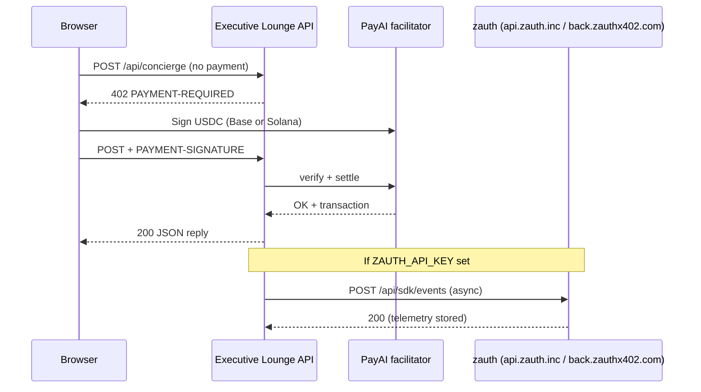
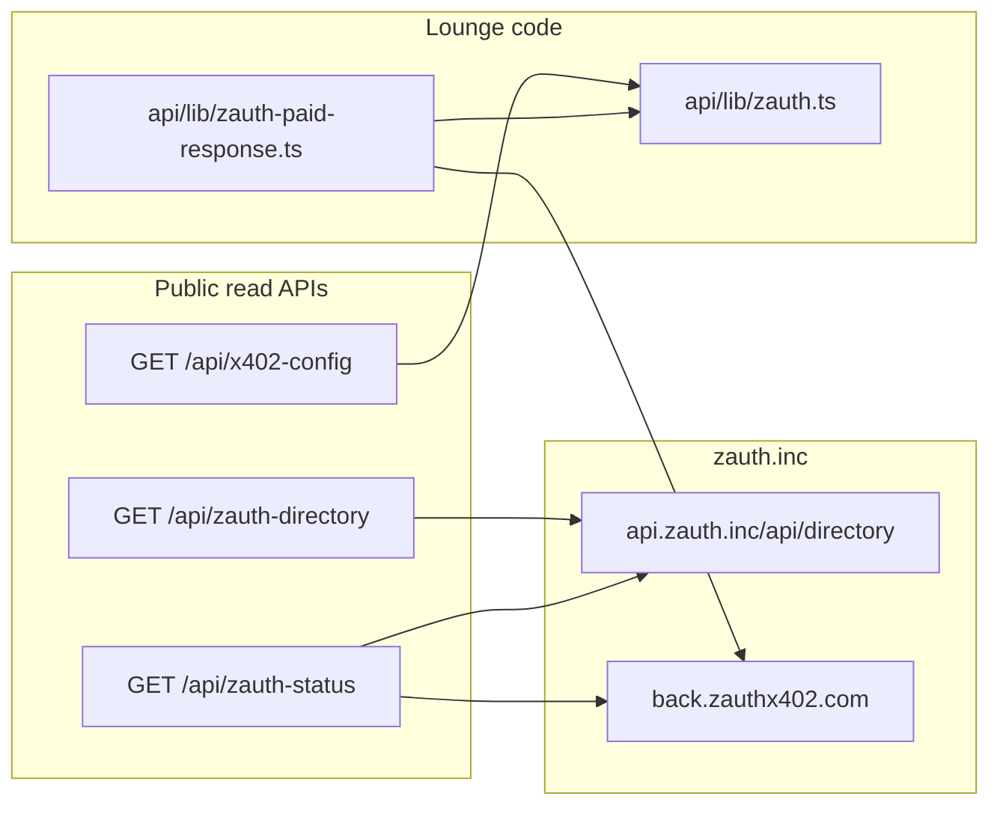

# zauth integration

Executive Lounge integrates [zauth](https://zauth.inc/) as the **x402 trust and telemetry layer** alongside PayAI settlement and [x402scan](x402scan.md) discovery. zauth helps agents and humans choose reliable paid APIs, surfaces uptime and verification in the [zauth Database](https://zauth.inc/database), and (with Provider Hub) supports optional **verified** badges for merchants.

This document describes what we built, how to configure it, and how agents or operators should use it.

## What zauth provides

| Capability | zauth product | How Lounge uses it |
|------------|---------------|-------------------|
| Endpoint directory | [Database API](https://zauth.inc/docs/database) | `GET /api/zauth-directory` (proxy) |
| Merchant telemetry | [Provider Hub](https://zauth.inc/provider-hub) | Fire-and-forget events after successful paid routes |
| Verification checks | Provider Hub API | `GET /api/zauth-status` when `ZAUTH_API_KEY` is set |
| Agent trust signals | Directory `verified`, `successRate`, `uptime` | Concierge system prompt + discovery links |

zauth does **not** replace PayAI verify/settle, wallet signing, or x402 pricing. Payments still flow through `api/lib/x402-server.ts` unchanged.

## Architecture





## Source files

| File | Role |
|------|------|
| `api/lib/zauth.ts` | Directory fetch, Provider Hub verification check, SDK-style event batching to `back.zauthx402.com` |
| `api/lib/zauth-paid-response.ts` | Maps x402 resource kinds → `reportPaidRouteToZauth()` |
| `api/zauth-directory.ts` | Edge route — CORS-open proxy to zauth directory |
| `api/zauth-status.ts` | Edge route — endpoints for this site origin + optional live checks |
| `api/lib/x402-discovery.ts` | Adds `discovery.zauth` link bundle to well-known / OpenAPI metadata |
| `api/lib/x402-config.ts` | Exposes `zauthTelemetryEnabled: boolean` on `/api/x402-config` |
| `public/executive-lounge.html` | Sidebar “x402 trust via zauth” badge when discovery links exist |

### Paid routes that report telemetry

After a **successful** x402 gate (HTTP 200), these handlers call `reportPaidRouteToZauth()`:

| Route | Resource kind | Expected response (for validation) |
|-------|---------------|-----------------------------------|
| `POST /api/concierge` | `concierge` | JSON with `reply` (HTML analysis) |
| `POST /api/news-open` | `news` | JSON with article `url` |
| `POST /api/lounge-signal-publish` | `signal-publish` | JSON with `published`, `signalId`, RWA fields |
| `POST /api/lounge-signal-open` | `signal-open` | JSON with `signal` summary |

Reporting is **fire-and-forget**: failures are logged as `[zauth] report` and do not affect the user response.

## Environment variables

| Variable | Required | Description |
|----------|----------|-------------|
| `ZAUTH_API_KEY` | No | Provider Hub API key. When set, enables telemetry and live verification in `/api/zauth-status`. |
| `ZAUTH_API_ENDPOINT` | No | Backend base URL (default `https://back.zauthx402.com`). |
| `X402_SITE_ORIGIN` | Recommended | Canonical site URL used to filter directory results (e.g. `https://conc-exe.xyz`). |

Example (`.env` / Vercel):

```bash
ZAUTH_API_KEY=your_provider_hub_api_key
# ZAUTH_API_ENDPOINT=https://back.zauthx402.com
X402_SITE_ORIGIN=https://your-production-domain.com
```

Without `ZAUTH_API_KEY`:

- Directory proxy and status (read-only directory slice) still work.
- No events are sent to Provider Hub.
- `zauthTelemetryEnabled` is `false` in `/api/x402-config`.
- Sidebar shows zauth link without “telemetry on”.

## Provider Hub setup (operators)

1. Open [Provider Hub](https://zauth.inc/provider-hub) and sign in (wallet or email).
2. Create an **API key** for your deployment.
3. Add `ZAUTH_API_KEY` to Vercel → Environment Variables (Production + Preview if desired).
4. Ensure x402 merchant addresses are configured (`X402_EVM_PAY_TO`, optional `X402_SOL_PAY_TO`) so paid routes return real 200 responses.
5. Redeploy. Complete at least one successful paid call per route you want listed (Concierge, news-open, etc.).
6. Within a few minutes, endpoints should appear in Provider Hub and the public [Database](https://zauth.inc/database). Aim for the **verified** badge per zauth’s hub criteria.

### What we send to Provider Hub

For each successful paid response, Lounge posts a batch to `POST {ZAUTH_API_ENDPOINT}/api/sdk/events` with:

1. **request** — method, URL, user-agent, presence of `PAYMENT-SIGNATURE` (not full secret dump).
2. **response** — status, truncated JSON body (max ~8 KB), `responseTimeMs`, validation result (`success`, `meaningful`, `meaningfulnessScore`).
3. **payment** (if payer + 200) — `payer`, `transactionHash`, `network` from `PAYMENT-RESPONSE` when available.

SDK version string: `executive-lounge-1.0` (`X-SDK-Version` header).

### Response validation (meaningfulness)

`api/lib/zauth.ts` scores responses before marking them meaningful:

| Status | Treatment |
|--------|-----------|
| 402 | Valid (payment challenge) — score 1.0 |
| 2xx with `reply`, `title`, `signalId`, or `published` | Meaningful (~0.95) |
| 2xx with other JSON | Meaningful (~0.7) |
| 2xx with `error` field | Not meaningful |
| 5xx | Not meaningful |

This helps zauth distinguish real Concierge answers from empty or error payloads.

## Public API routes

### `GET /api/zauth-directory`

Proxy to `https://api.zauth.inc/api/directory` with Lounge CORS (`Access-Control-Allow-Origin: *`) for agent browsers.

**Query parameters:**

| Param | Type | Description |
|-------|------|-------------|
| `search` | string | Host or URL fragment (e.g. `conc-exe.xyz`) |
| `network` | string | Filter by network id |
| `status` | string | Directory status filter |
| `verified` | `true` / `false` | Verified endpoints only |
| `limit` | number | Max 100 (default 50) |
| `offset` | number | Pagination offset |

**Example:**

```bash
curl -s "https://your-production-domain.com/api/zauth-directory?search=concierge&verified=true&limit=20" | jq
```

**Response (200):** zauth directory JSON plus:

```json
{
  "endpoints": [ { "url": "...", "verified": true, "successRate": 0.98 } ],
  "pagination": { "total": 42, "limit": 20, "offset": 0, "hasMore": true },
  "stats": { "totalEndpoints": 1000, "verified": 120, "working": 800 },
  "source": "zauth.inc",
  "links": {
    "providerHubUrl": "https://zauth.inc/provider-hub",
    "databaseUrl": "https://zauth.inc/database",
    "docsUrl": "https://zauth.inc/docs",
    "directoryApiUrl": "https://api.zauth.inc/api/directory",
    "statusUrl": "https://your-production-domain.com/api/zauth-status",
    "directoryProxyUrl": "https://your-production-domain.com/api/zauth-directory"
  }
}
```

Agents may call zauth directly: `GET https://api.zauth.inc/api/directory` — see [zauth Database docs](https://zauth.inc/docs/database).

### `GET /api/zauth-status`

Health snapshot for **this deployment’s origin** (`X402_SITE_ORIGIN` or request host).

**Example:**

```bash
curl -s https://your-production-domain.com/api/zauth-status | jq
```

**Response (200):**

```json
{
  "origin": "https://your-production-domain.com",
  "endpoints": [
    {
      "url": "https://your-production-domain.com/api/concierge",
      "verified": true,
      "successRate": 0.99,
      "uptime": 0.998
    }
  ],
  "directory": { "totalEndpoints": 5000, "verified": 200, "working": 4000 },
  "providerCheck": [
    {
      "verified": true,
      "working": true,
      "meaningful": true,
      "lastChecked": "2026-05-21T12:00:00.000Z",
      "uptime": 0.99
    }
  ],
  "providerTelemetryEnabled": true,
  "links": { "...": "..." }
}
```

- `endpoints` — directory rows whose URL contains this host.
- `providerCheck` — up to 8 live checks via Provider Hub (`/api/verification/check`) when `ZAUTH_API_KEY` is set; empty/false when not configured.
- Cached `Cache-Control: public, max-age=120`.

On directory failure: **502** with `{ "error": "...", "links": { ... } }`.

### `GET /api/x402-config`

Includes:

```json
{
  "zauthTelemetryEnabled": true,
  "discovery": {
    "zauth": {
      "providerHubUrl": "https://zauth.inc/provider-hub",
      "databaseUrl": "https://zauth.inc/database",
      "docsUrl": "https://zauth.inc/docs",
      "directoryApiUrl": "https://api.zauth.inc/api/directory",
      "statusUrl": "https://your-production-domain.com/api/zauth-status",
      "directoryProxyUrl": "https://your-production-domain.com/api/zauth-directory"
    }
  }
}
```

Used by the lounge UI to render the sidebar trust line.

## UI integration

In `public/executive-lounge.html`, `refreshZauthTrustBadge()` reads `/api/x402-config` and shows:

- **x402 trust via [zauth](https://zauth.inc/provider-hub)** — always when `discovery.zauth` exists.
- **· telemetry on** — when `zauthTelemetryEnabled` is true (`ZAUTH_API_KEY` present on server).

No wallet or extra user action is required for telemetry; it is server-side after payment.

## Concierge and agent-to-agent (A2A)

`api/lib/concierge-brain.ts` instructs the model to:

- Query `/api/zauth-directory` or the zauth Database before recommending **third-party** x402 APIs.
- Prefer endpoints with `verified: true` and high `successRate`.

Lounge’s **own** paid APIs are also listed in zauth once telemetry and directory indexing include them; agents paying Concierge still use normal x402 client flow (`public/js/x402-pay.mjs`), not zauth as a payment rail.

## Edge-safe design (no `@zauthx402/sdk` on Vercel)

zauth’s official [`@zauthx402/sdk`](https://www.npmjs.com/package/@zauthx402/sdk) targets **Express/Node** middleware (auto-refunds, richer hooks). Executive Lounge runs on **Vercel Edge** for paid APIs, so we use:

- Plain `fetch` to zauth directory and Provider Hub backends.
- A minimal event schema compatible with `POST /api/sdk/events`.

**Payment behavior is unchanged** — no extra latency on the critical path beyond an async background POST after 200.

If you later run a dedicated Node gateway, you can add the full SDK there; keep the Edge reporter for serverless routes or migrate those routes to Node.

## Operations checklist

| Step | Action |
|------|--------|
| 1 | Set `X402_EVM_PAY_TO` / `X402_SOL_PAY_TO` and confirm PayAI settlements work |
| 2 | Set `ZAUTH_API_KEY` from Provider Hub |
| 3 | Set `X402_SITE_ORIGIN` to production URL |
| 4 | Redeploy; run one paid Concierge message and one news-open |
| 5 | `curl /api/zauth-status` — confirm endpoints listed |
| 6 | Open Provider Hub — confirm telemetry and verification status |
| 7 | Optional: search your domain on [zauth Database](https://zauth.inc/database) |

## Troubleshooting

| Symptom | Likely cause | Fix |
|---------|----------------|-----|
| `providerTelemetryEnabled: false` | No `ZAUTH_API_KEY` | Add key in Vercel, redeploy |
| Empty `endpoints` in status | Domain not indexed yet | Generate paid traffic; wait; check `X402_SITE_ORIGIN` host matches directory URLs |
| `[zauth] report` in logs | Invalid API key or backend down | Rotate key; check `ZAUTH_API_ENDPOINT` |
| `providerCheck` all false | Key missing or verification API error | Confirm key; test hub manually |
| Directory 502 | zauth API timeout/down | Retry; call `api.zauth.inc` directly to isolate |
| Telemetry on but not verified | zauth hub rules not met | Follow Provider Hub docs for verified criteria |
| Concierge still suggests risky APIs | Model guidance only | Ensure agents use `/api/zauth-directory?verified=true` in tooling |

## Security notes

- **Never** commit `ZAUTH_API_KEY` — Vercel env only. See [security.md](security.md).
- Telemetry truncates large response bodies; payment signatures are not stored in full in events.
- `/api/zauth-directory` is intentionally CORS-open for agents; it only proxies public directory data.
- zauth does not grant access to paid routes without x402 payment.

## Related documentation

- [zauth official docs](https://zauth.inc/docs)
- [Provider Hub](https://zauth.inc/provider-hub)
- [Database API](https://zauth.inc/docs/database)
- [x402 payments](x402-payments.md) — PayAI flow and pricing
- [x402scan](x402scan.md) — Marketplace discovery (complementary to zauth)
- [API reference](api-reference.md) — Route index including zauth endpoints
- [Configuration](configuration.md) — All environment variables
